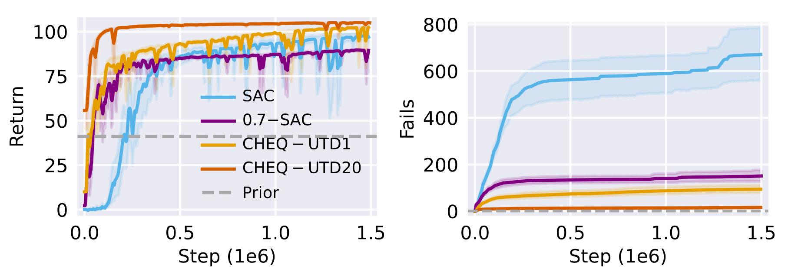
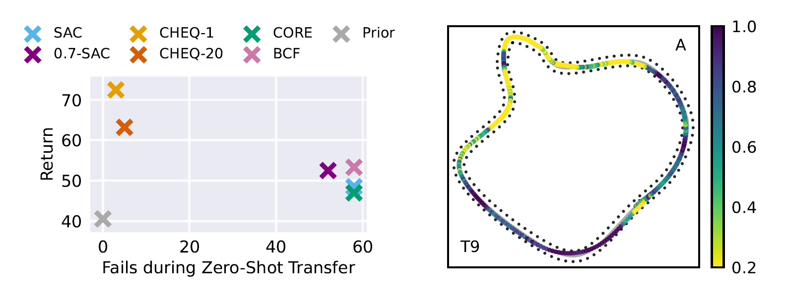
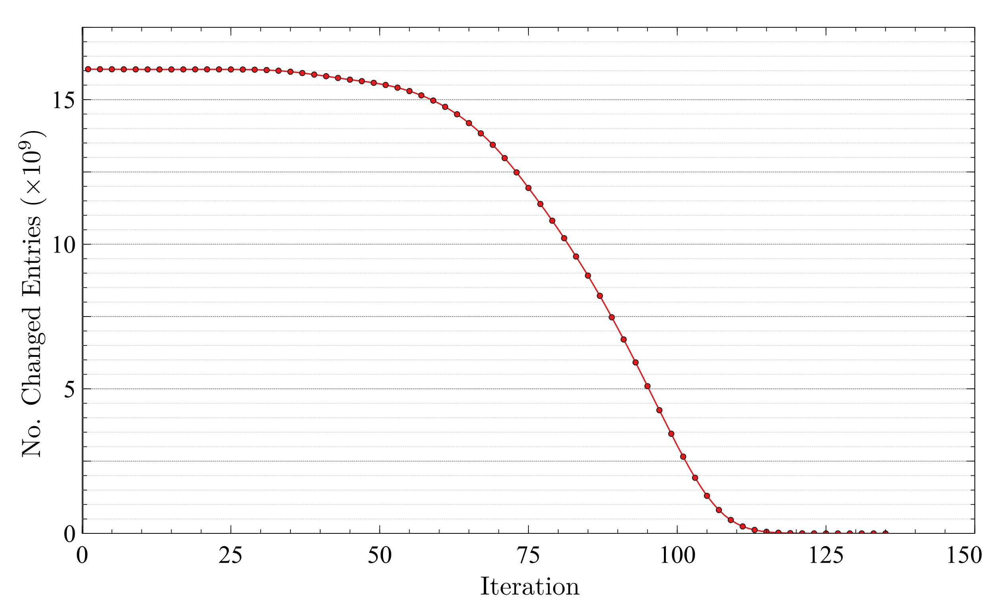
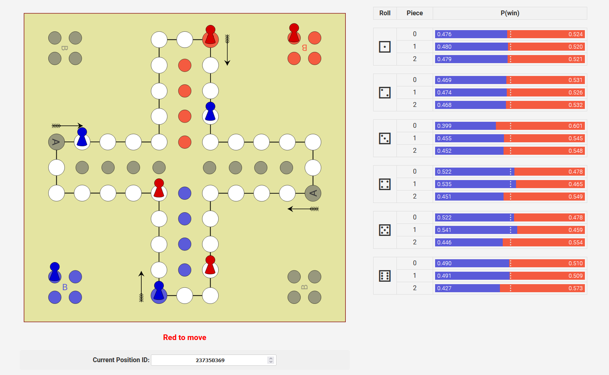

# Portfolio
This file gives an overview of (published) projects that I have worked on over the years, summarizing the *project idea*, detailing my *involvement*, discussing *key challenges* and *proposed solutions*, and showcasing the *achieved results*. The presented projects are:
- [Master Thesis: Uncertainty-based Reinforcement Learning](#uncertainty-based-reinforcement-learning)
- [Bachelor Thesis: Winning Probabilities for Mensch Ärgere Dich Nicht](#winning-probabilities-for-mensch-ärgere-dich-nicht)
- [Reinforcement Learning Algorithm Library](#reinforcement-learning-algorithm-library)
- [Classic AI for Multi-Player Reversi](#classic-ai-for-multi-player-reversi)
- [Reinforcement Learning AI for Kore22 Kaggle Challenge](#reinforcement-learning-ai-for-kore22-kaggle-challenge)
---
## Uncertainty-based Reinforcement Learning
- **GitHub**: https://github.com/Data-Science-in-Mechanical-Engineering/cheq
- **Techstack**: Python, Conda, Pytorch, Gymnasium, Jupyter Notebook, Slurm

### Project Overview
I worked on this project as my Master's thesis at the Institute for Data Science in Mechanical Engineering at the RWTH Aachen in the winter term 2023/24 and was supervised by Emma Cramer and Bernd Frauenknecht. The basic idea was to improve the reliability and safeness of Reinforcement Learning algorithms by combining them with provably safe classic control techniques. To get the best out of both worlds, we set out to make the combination adaptive, based on the estimated uncertainty of the RL agent. In this way the RL agent falls back to the control prior only in situations it does not know what is going on and thus circumvent the otherwise possibly unsafe and inefficient exploration process.

### Tasks
I was responsible for the full research stack:
- *Researching* the state-of-the-art for RL/control combination and uncertainty estimation 
- *Reassembling* of prior work to *engineer* a novel algorithm
- *Implementing* the algorithm and *embedding* it into the environment framework
- *Scheduling experiments* on the cluster and *evaluating* them
- *Visualizing* and *presenting* findings to supervisors for further discussion

### Challenges
I would classify the encountered key challenges in two different classes: *Lack of Background* and *Uncertainty of Research*.

#### Lack of Background
I agreed working on the topic because of my interest in Reinforcement Learning. However, I had no background in Mechanical Engineering or Physics. This quickly became a liability in discussions with my supervisors, as I could not follow their thought process due to the lack of vocabulary and understanding of basic concepts, e.g. I did not know what a "control gain", "end-effector" or "LQR" is. Further, I found that I had a serious lack of mathematical skill when it came to continuous problems. The Computer Science studies at the university focused mostly on discrete mathematics and did not prepare me to work with integrals or differential equations, which are ubiquitous in physical control problems and important for their intuitive understanding.
This challenge required me to intensively review the relevant concepts and mathematics by studying explanatory materials. My supervisors also did a great job of providing me with links to helpful literature.

#### Uncertainty of Research
Although we had a rough idea in mind where we would like the project to go, there were many uncertainties about the next steps and decisions to take (which I now understand as a typical property of research projects). These uncertainties pose challenges from a software engineering point of view as they require a continuously evolving code base that meets dynamically changing requirements for functionality that are hard to foresee. "Now that I think about it, we should also benchmark against algorithm X, can you include it into the code base?" is a perfect example of such a requirement. Serving the online feature requirements becomes a tradeoff between delivering quick results and maintaining a well-structured code base. Cleaning up the project is "lost" time but neglecting it for too long results in hard-to-understand and error-prone code.
This challenge demanded me to keep a mindful balance between progress and order. I also had to grow a thicker fur, becoming less attached to code I have written and more emotionally indifferent to changes that have to be made.

### Results
Our approach of uncertainty-based adaption between RL agent and control prior (CHEQ) showed to drastically increase the training speed and training safety compared to competitor approaches on a car-racing environment, decreasing the amount training failures compared to its downstream vanilla RL algorithm (Soft Actor-Critic) by 97.5%.

Further, the algorithm shows a high degree of safety even in unseen (out-of-distribution) situations, by recognizing its uncertainty and handing over the control to the safe control prior.

A paper summarizing the methodology and results has been accepted and presented at the Reinforcement Learning Conference (RLC) 2024 in Amherst, MA, USA. You can find the paper on [arXiv](https://arxiv.org/abs/2406.19768).

---
## Winning Probabilities for Mensch Ärgere Dich Nicht
- **GitHub**: https://github.com/limarman/Mensch-Aergere-Dich-Nicht
- **Techstack**: C++, Slurm, (Website: HTML, CSS, Javascript)
### Project Overview
[Mensch Ärgere Dich Nicht](https://en.wikipedia.org/wiki/Mensch_%C3%A4rgere_Dich_nicht) (MadN) is a famous German board game. This project aimed to compute the (Nash-)optimal playing strategy and the corresponding winning probabilities for every possible position of the 2-player variant of the game through a brute-force value iteration algorithm. This project was part of my Bachelor's Thesis during the summer term 2019 and was supervised by Prof. Peter Rossmanith and Dr. Henri Lotze.
### Tasks
On the practical side my tasks were:
- Implementing the game logic following the rule set specification
- Implementing the value iteration algorithm
- Scheduling computations on the cluster
- Evaluating and retrieving insights from the resulting data

Theoretically, I have worked on formalizing the method mathematically and proving its correctness.
### Challenges
The biggest technical challenge was to design a bijective encoding/decoding function to assign each position a unique identifier. It required a certain degree of creativity to come up with the hierarchical encoding/decoding algorithm I used in the end.
Apart from that, another big challenge was the scale of the problem. The 2-player version of MadN has about 16 billion possible positions (excluding symmetry). Saving one float value for the winning probability for every position results in unwieldy file sizes of >60GB. Further, because of the scale, the computation becomes very time-expensive and does not leave room for failure as a recomputation would exceed the available quota. To deal with this, I followed the strategy of testing the algorithm on (artificial) smaller instances of the game first. Additonally, I implemented a mechanism to periodically backup the interim results in case the computation aborts unexpectedly.

### Results
The algorithm successfully converged after around 140 compute hours on a 48 core machine with a clock rate of 2.1Ghz, returning the optimal winning probabilities for every possible position. The optimal playing strategy can be easily obtained from the probability table by choosing the successor with the highest winning probability.

To make the results accessible to the public, I am currently developing a website that will provide an interactive interface for users to explore the winning probabilities. This is a screenshot of how it looks so far:

More details regarding the mathematical foundation, implementation, and results can be found in my [thesis](https://raw.githubusercontent.com/limarman/Mensch-Aergere-Dich-Nicht/master/thesis.pdf).

---
## RL Algorithm Library
---
## Multi-player Reversi AI
---
## Kore22 AI
---